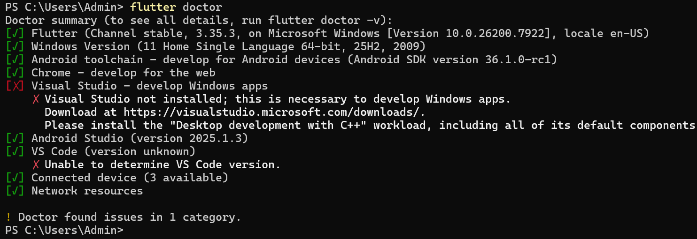
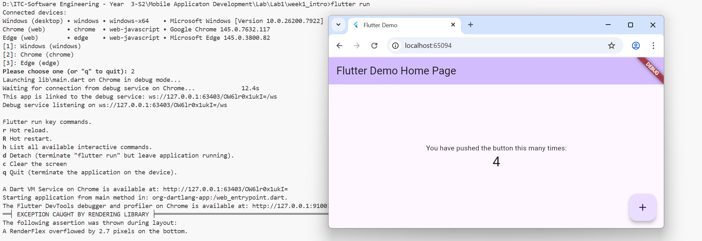
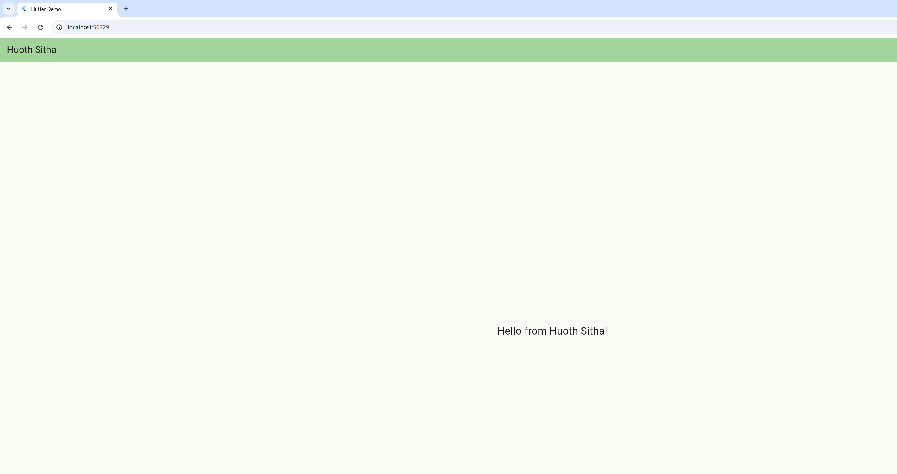
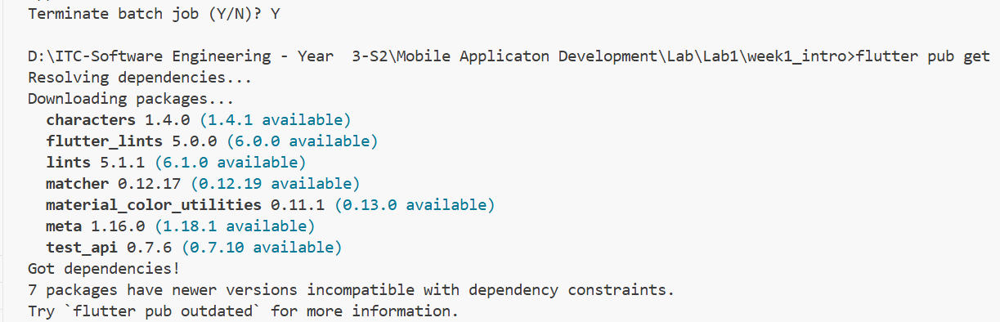
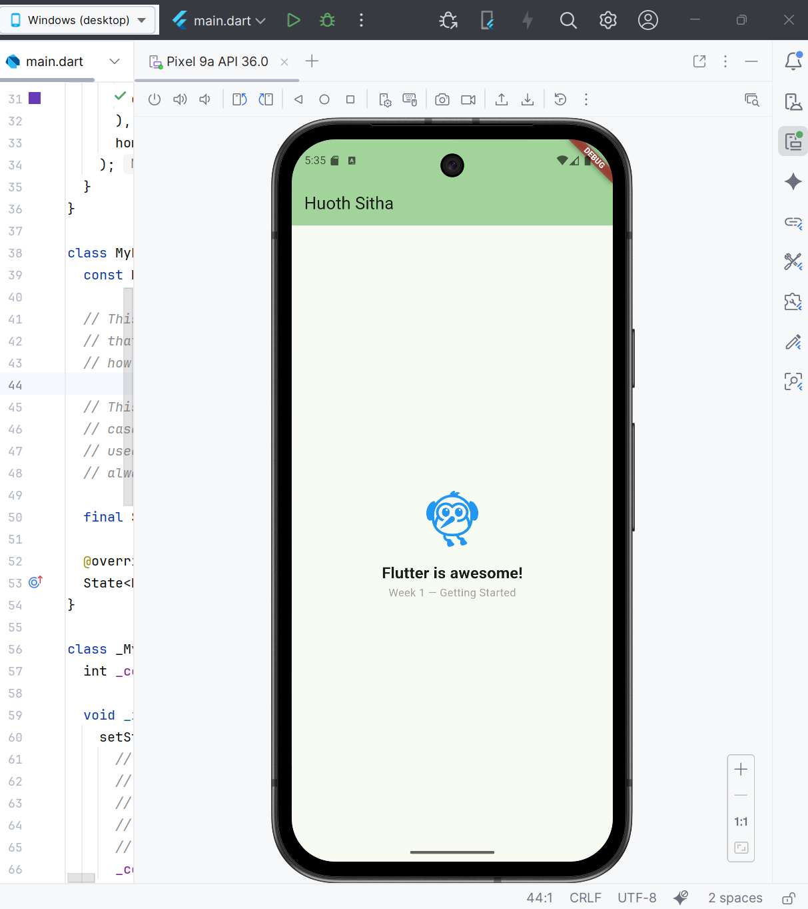

**Name:** Huoth Sitha

**ID:** P20230039

**Subject:**   Mobile App Development

**Lecturer:**   Mr. HOK Tin

### Exercise 1 — Environment Validation

1. **Run `flutter doctor`**

   Open your terminal or command prompt and execute:

   ```bash
   flutter doctor

**Result:**



### Exercise 2 — First Project

1. **Run `flutter doctor`**

   Open your terminal or command prompt and execute:

   ```bash
   flutter create week1_intro

**Result:**





### Exercise 3 — Customize the Home Screen

1. **Open `main.dart`**

   Navigate to the `lib` folder in your project (`week1_intro/lib/main.dart`) and open the file in your code editor.

2. **Modify the AppBar Title**

   Find the `AppBar` widget and change the title to your name:

   ```dart
   appBar: AppBar(
     title: Text('Huoth Sitha'),
   ),

**Result:**





### Exercise 4 — Explore pubspec.yaml

1. **Open `pubspec.yaml`**

   Navigate to the root folder of your Flutter project (`week1_intro/pubspec.yaml`) and open the file in your code editor.

2. **Locate App Name and Version**

   At the top of the file, you will see lines like:

   ```yaml
   name: week1_intro   # App name
   description: A new Flutter project.
   version: 1.0.0+1    # Version number

**Result:**




### Exercise 5 — Widget Exploration

1. **Open `main.dart`**

   Navigate to `lib/main.dart` and locate the `body` property of your `Scaffold` in `_MyHomePageState`.

2. **Replace the `body` Content**

   Replace the existing `body` with the following code:

   ```dart
   body: Column(
     mainAxisAlignment: MainAxisAlignment.center,
     children: [
       const Icon(
         Icons.flutter_dash,
         size: 80,
         color: Colors.blue,
       ),
       const SizedBox(height: 16), // Vertical spacing
       const Text(
         'Flutter is awesome!',
         style: TextStyle(
           fontSize: 20,
           fontWeight: FontWeight.bold,
         ),
       ),
       const Text(
         'Week 1 — Getting Started',
         style: TextStyle(color: Colors.grey),
       ),
     ],
   ),

**Result:**


